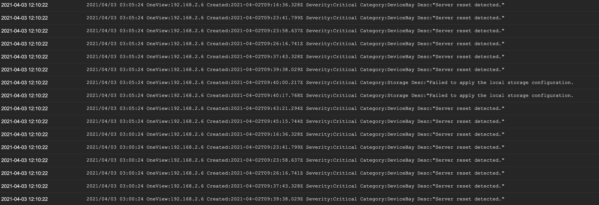

# HPE OneView Event Logger
This is just logging HPE OneView events to log file by using OneView API. HPE OneView may have event log forwarding features. I was lazy to look for it. That's why I made this.  

## Quick Start
[Download binary](https://github.com/fideltak/oneview-event-logger/releases) or [Docker Image](https://hub.docker.com/repository/docker/fideltak/oneview-event-logger) and run it.  
You can set parameters as environment value.  

```
# tar xvfz oneview-event-logger-<VERSION>-<OS>-amd64.tar.gz 
# OV_ADDR=192.168.2.6 OV_USER=golang OV_PASSWORD=golangtest ./oneview-event-logger
```

After few minutes, you can see OneView events in logfile.

```
# cat /tmp/oneview_evnet.log
2021/04/02 15:09:55 OneView:192.168.2.6 Created:2021-04-01T10:43:00.238Z Severity:OK Category:drive-enclosure Desc:"Drive removed from drive bay 17."
2021/04/02 15:09:55 OneView:192.168.2.6 Created:2021-04-01T10:42:58.042Z Severity:Critical Category:drive-enclosures Desc:"Unable to communicate with the drive in drive bay 11. "
2021/04/02 15:09:55 OneView:192.168.2.6 Created:2021-04-01T10:42:50.352Z Severity:OK Category:drive-enclosure Desc:"Drive inserted into drive bay 37."
2021/04/02 15:09:55 OneView:192.168.2.6 Created:2021-04-01T10:42:49.441Z Severity:OK Category:drive-enclosure Desc:"Drive inserted into drive bay 39."
```

## Parameters
You can set parameters in OS environment value.  

| Key | Default | Description |
| :---: | :---: | :---: |
| OV\_INTERVAL | 60 | Event scan interval sec |
| OV\_ADDR |  | OneView address or hostname |
| OV\_USER |  | OneView user name |
| OV\_PASSWORD |  | OneView user password|
| OV\_VERSION | 1200 | OneView API version|
| OV\_LOG\_PATH | /tmp/oneview_evnet.log | Log path|
| OV\_LOG\_MAX\_SIZE\_MB | 50 | Log rotation size MB|
| OV\_LOG\_MAX\_BACKUPS | 5 | Number of log backup|
| OV\_LOG\_MAX\_AGE | 365 | Days of keeping old logs| 
| OV\_LOG\_COMPRESS | true | Old log compression |

## Wiz Zabbix
You can use this with Zabbix. Actually the reason that I made this is for zabbix.  
In Zabbix, You can use External Scrpit or Javascript to gather OneView events via OneView API but it seems that Zabbix inserts multiple events into one entry. I feel it is not good visually to monitor systems.(I'm not sure Zabbix can separate JSON list...)  
Therefore I'm using this app with zabbix agents by using zabbix-agnet log monitoring. Each incidents are inserted each entry in Zabbix.  
You can see more details what mentioned above [here](https://github.com/fideltak/zabbix_oneview_sample).

I recommend to use k8s to integrate zabbix-agent and oneview-event-logger like below.  
Sample manifests is [here](deploy/k8s/wiz_zabbix_agent).  
[Docker Image](https://hub.docker.com/repository/docker/fideltak/oneview-event-logger)

```
┌────────────────────────────────────────────────────────────────┐
│ Pod                                                            │
│ ┌───────────────────────────┐   ┌────────────────────────────┐ │
│ │<Container>                │   │<Container>                 │ │
│ │zabbix-agent               │   │oneview-event-logger        │ │
│ │                           │   │                            │ │
│ │                           │   │                            │ │
│ └───────────────┬───────────┘   └────┬───────────────────────┘ │
│                 │                    │                         │
│           ┌─────▼────────────────────▼──────────────┐          │
│           │<Persistent Volume:RWX>                  │          │
│           │ /var/log/oneview/events.log             │          │
│           │                                         │          │
│           └─────────────────────────────────────────┘          │
│                                                                │
└────────────────────────────────────────────────────────────────┘
```

You can see some events in Zabbix like below.  
I created Zabbix Item to get *Critical* events (`log[/var/log/oneview/events.log, "Critical"]`) in OneView.  

